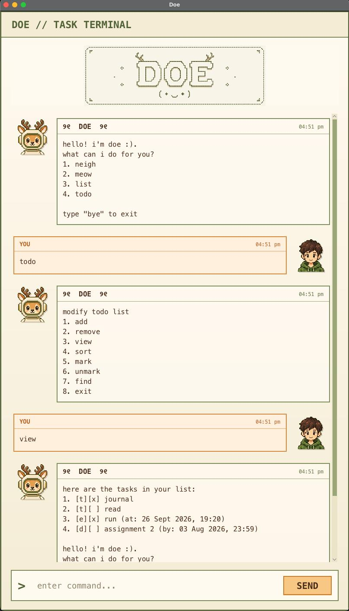

# Doe User Guide

> hello! i'm **doe** :D — a dough loving fawn who keeps your tasks from wandering off.

**doe** stores todos, deadlines, and events, then helps you view, search, sort, complete, or remove them. Your changes are saved automatically, so your herd will still be here the next time **doe** starts.



## Quick start

Type a command into the message box and press <kbd>Enter</kbd>. **doe** shows numbered menus along the way; you may enter either the **number** or the **word** beside it.

For example, to add a deadline:

1. Enter `todo` to open the task menu.
2. Enter `add`.
3. Enter `deadline`.
4. Enter a description, such as `submit assignment`.
5. Enter its date and time as `20-09-2026 2359`.

That is it. **doe** saves the task and trots back to the main menu.

> **Date format:** use `dd-mm-yyyy hhmm` with a 24-hour time. For example, `07-10-2026 0930` means 7 October 2026 at 9:30 AM.

## Main menu

| Enter | What **doe** does                                          |
| --- |--------------------------------------------------------|
| `neigh` or `1` | Offers a motivational neigh. Volume not guaranteed.    |
| `meow` or `2` | Demonstrates doe's suspiciously good cat impression.   |
| `list` or `3` | Reminds you of your responsibilities.                  |
| `todo` or `4` | Opens the task menu. This is where doe becomes useful. |
| `bye` | Say goodbye to doe.                                    |

Commands are not case-sensitive, and extra spaces around them are ignored.

## Managing tasks

Begin with `todo`, then choose one of these actions. After most actions, **doe** returns to the main menu; enter `todo` again for another task action.

| Action | How to use it                                                                                             |
| --- |-----------------------------------------------------------------------------------------------------------|
| `add` or `1` | Choose `todo`, `deadline`, or `event`, and follow doe's prompts.                                          |
| `remove` or `2` | Enter the task's number or its exact description. Using the number is safest when two tasks share a name. |
| `view` or `3` | Displays every saved task.                                                                                |
| `sort` or `4` | Sorts deadlines and events from earliest to latest, followed by undated todos. The new order is saved.    |
| `mark` or `5` | Enter a task number to mark it complete.                                                                  |
| `unmark` or `6` | Enter a task number to make it incomplete again. No judgement here.                                       |
| `find` or `7` | Enter part of a description to find matching tasks. Search is not case-sensitive.                         |
| `exit` or `8` | Leaves the task menu without closing doe.                                                                 |

### Adding the three task types

| Type | Best for | Example answers to doe's prompts        |
| --- | --- |-----------------------------------------|
| `todo` | A task with no date | `read chapter 7`                        |
| `deadline` | Something due by a date and time | `submit assignment` → `20-09-2026 2359` |
| `event` | Something happening at a date and time | `team meeting` → `21-09-2026 1400`      |

In the task list, `[t]`, `[d]`, and `[e]` mean todo, deadline, and event. `[x]` means complete; `[ ]` means it is still waiting patiently.

```text
1. [t][ ] read chapter 7
2. [d][x] submit assignment (by: 20 Sep 2026, 23:59)
3. [e][ ] team meeting (at: 21 Sep 2026, 14:00)
```

## Handy notes

- Task descriptions cannot be blank or contain the `|` character.
- `find` searches task descriptions and keeps the original task numbers, so you can use those numbers with `mark`, `unmark`, or `remove`.
- Entering an empty search shows all tasks.
- If a date is rejected, check that it is a real date and follows `dd-mm-yyyy hhmm` exactly.
- **doe** writes your tasks down in `todo.txt`. Avoid editing that file while doe is running; let the professional handle the paperwork.

When the list is calm and your work is done, return to the main menu and enter `bye`. **doe** will see you on the next bake.
